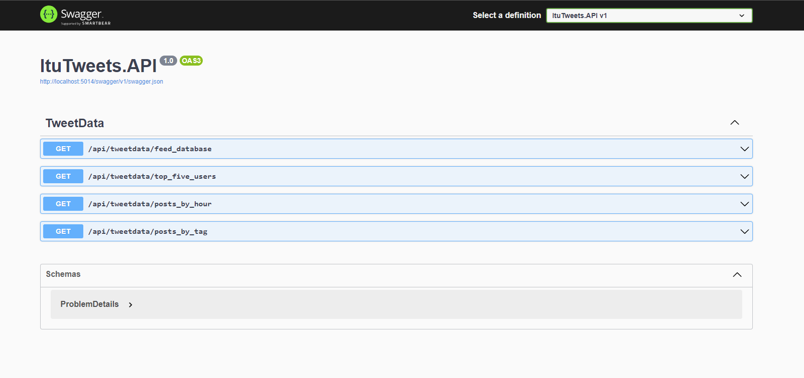
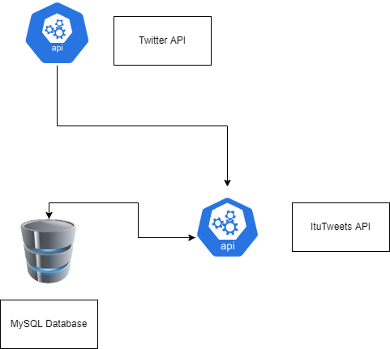

# ItuTweets API

API Desenvolvida em .NET 6 para busca de tweets e tratamento dos dados, para as seguintes hashtags:
- #openbanking, #remediation, #devops, #sre, #microservices, #observability, #oauth, #metrics, #logmonitoring, #opentracing

## Pré-requisitos :exclamation:
- [.NET 6](https://docs.microsoft.com/en-us/aspnet/core/?WT.mc_id=dotnet-35129-website&view=aspnetcore-6.0)
- [Docker Engine](https://docs.docker.com/engine/install/)

## Como rodar a aplicação :arrow_forward:
- Faça o download do projeto ZIP e extraia os arquivos no diretório de sua preferência, ou se preferir clone o projeto com o comando `$ git clone https://github.com/Cadulox/itutweets.git`

- Acesse o diretório do projeto e execute o comando abaixo para provisionar o banco de dados:
```
> docker-compose up -d
```

- Entre no diretório ItuTweets com `cd .\ItuTweets\` e execute o seguinte comando:
```
> dotnet run
```

:warning: A aplicação subirá na porta  `5014`

## Recursos disponíveis da aplicação
Recurso | Verbo HTTP | Path
------- | ---------- | ----
Feed Database | GET | api/tweetdata/feed_database
Top Five Users | GET | api/tweetdata/top_five_users
Posts By Hour | GET | api/tweetdata/posts_by_hour
Posts By Tag | GET | api/tweetdata/posts_by_tag?tag=sre

## Swagger da Aplicação
`http://localhost:5014/swagger/index.html`

<p align="center">
    
</p>
- É possível verificar o comportamento dos recursos utilizando [Postman](https://www.postman.com/) com a collection `Itutweets.postman_collection.json` disponível no repositório.

## Desenho de Arquitetura do Sistema
<p align="center">
    
</p>

## Pontos de Melhoria
- Segregar a parte alimentação do bando de dados em uma scheduler app, ou utilizar eventos com Azure Functions / Aws Lambda;
- Configurar Connection Strings, TOKEN, Keys em secrets;
- Retirar as hashtags hardcode do código e passar par um arquivo de configuração da app ou uma tabela no banco de dados;
- Adicionar testes unitários e testes de integração;
- Adicionar e configurar SonarQube para cobertura e qualidade do código;
- Criar docker image da app e configurar para que ao subir um container conecte-se a outros serviços;
- Adicionar ferramentas para captura de logs, por exemplo: Datadog, Splunk, Elasticsearch
- Adicionar ferramentas para coleta de métricas de infraestrutura da app, por exemplo: Prometheus + Grafana
- Realizar testes de cargas e de estresse utilizando K6 ou JMeter;
- Configurar esteira de CI/CD;
- Disponibilizar a aplicação em cloud púlbica, por exemplo: AWS, Azure, GCP

## Desenvolvedores/Contribuintes :octocat:
<table>
  <tr>
    <th> <a href="https://www.linkedin.com/in/carlos-eduardo-lourenco/" target="_blank"> </a> </th>
  </tr>
  <tr>
    <td><h4> Carlos Eduardo </h4></td>
  </tr>  
</table>
